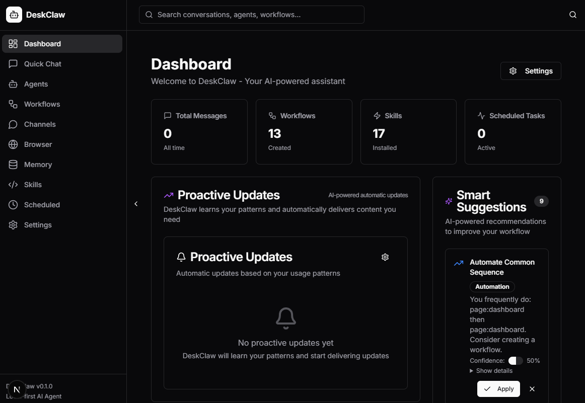
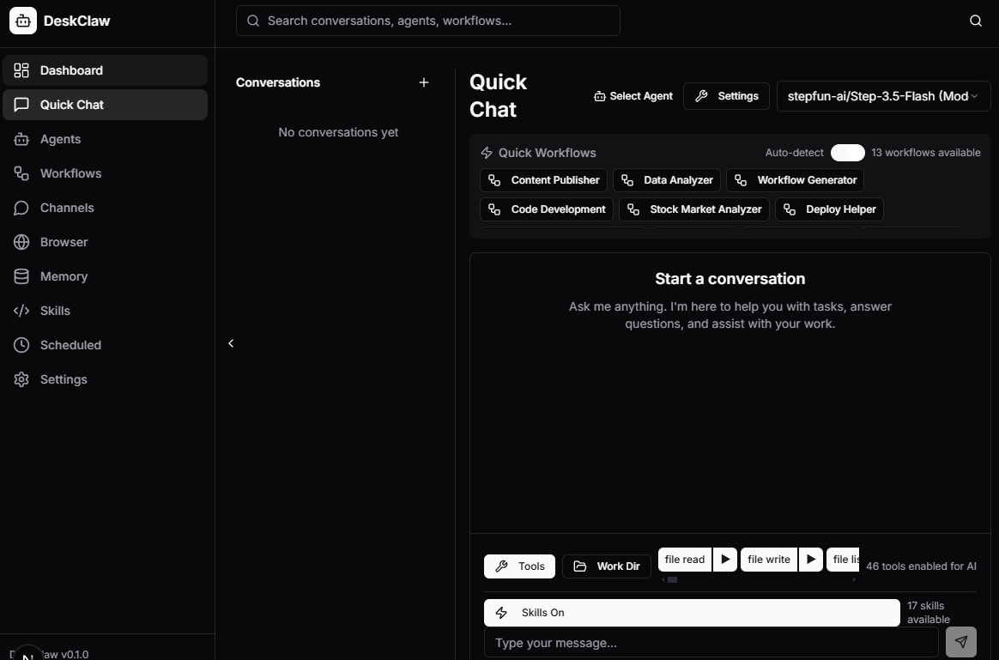
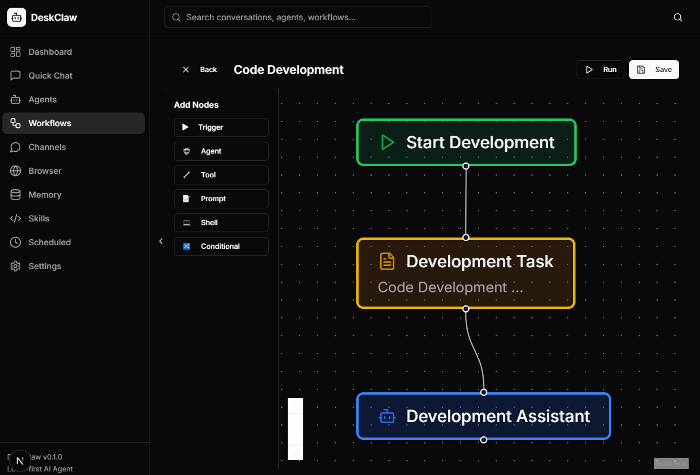
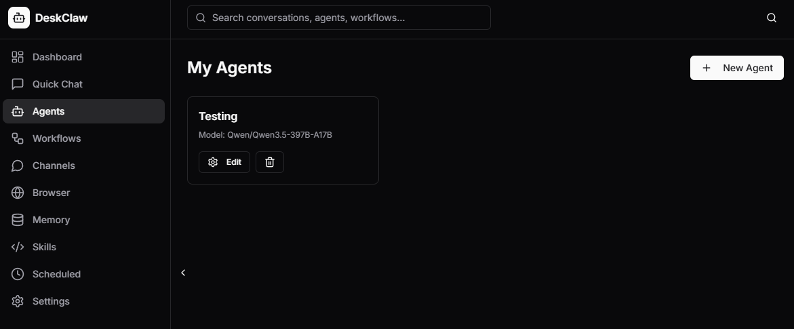
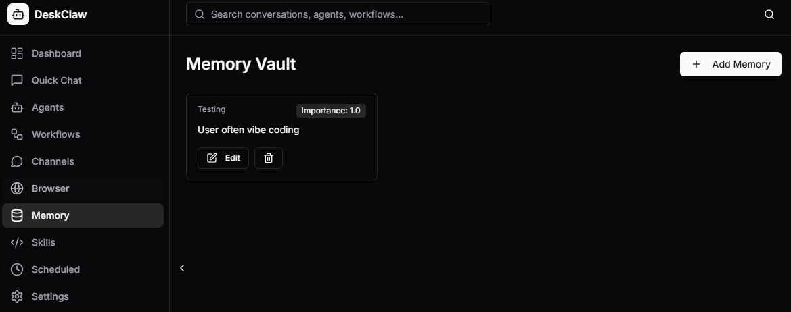
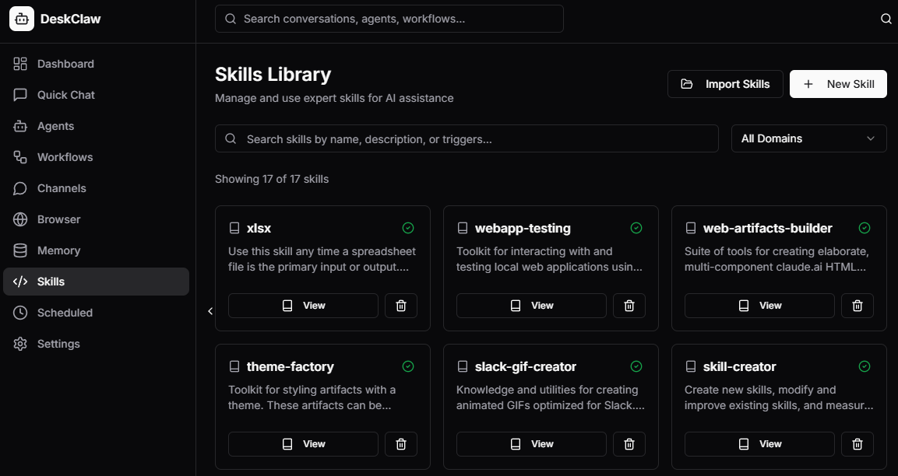
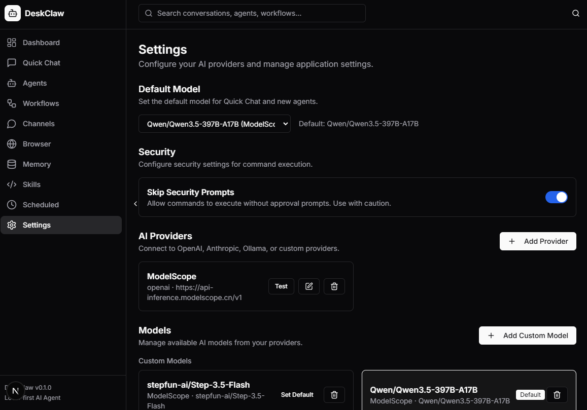
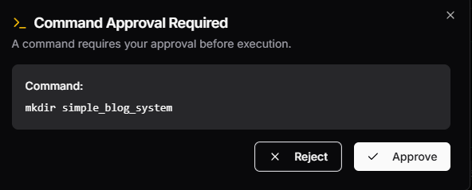
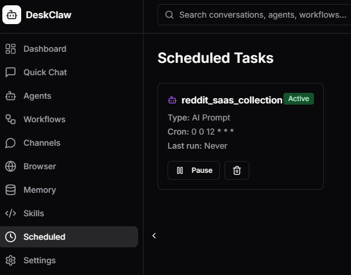
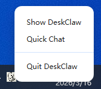

<div align="center">

# DeskClaw

**Local-first, privacy-focused AI Agent desktop application**

[](https://opensource.org/licenses/MIT)
[](https://www.electronjs.org/)
[](https://react.dev/)
[](https://nextjs.org/)

</div>

## Overview

DeskClaw is a desktop application that brings power of AI agents to your local machine. It prioritizes privacy by storing all data locally and supports multiple AI providers including OpenAI, Anthropic, Ollama, and custom endpoints.

<!-- 📸 Screenshot: Main Application Interface -->
<p align="center">
  
  <br>
  <em>DeskClaw main application interface</em>
</p>

## Features

### Core Features

<!-- 📸 Screenshot: Quick Chat Interface -->
<p align="center">
  
  <br>
  <em>Quick Chat with streaming AI responses</em>
</p>

- **Multiple AI Provider Support**: Connect to OpenAI, Anthropic, Ollama, or custom APIs
- **Custom Model Persistence**: Add custom models with connection testing - models persist across restarts
- **Streaming LLM Responses**: Real-time streaming output for chat interactions
- **Session Management**: Conversations are saved and can be resumed anytime

<!-- 📸 Screenshot: Workflow Visual Editor -->
<p align="center">
  
  <br>
  <em>Visual workflow editor with drag-and-drop nodes</em>
</p>

- **Workflow Visual Editor**: Drag-and-drop workflow canvas with multiple node types
- **Approval Gate**: Security mechanism for dangerous shell commands
- **Local Data Storage**: All conversations, agents, and workflows stored locally with SQLite
- **Encryption**: API keys encrypted with AES-256-GCM

### Advanced Features

- **Memory System**: Long-term memory storage for agents
- **Scheduled Tasks**: Automate workflows with cron-like scheduling
- **System Tray**: Background execution with quick access
- **Modern UI**: Built with shadcn/ui and Tailwind CSS

<!-- 📸 Screenshot: Browser Control -->
<p align="center">
  
  <br>
  <em>Browser automation with MCP integration</em>
</p>

- **MCP Browser Integration**: Control Chrome via Model Context Protocol
- **Browser Automation**: Navigate, screenshot, click, type, and evaluate JavaScript
- **Session Management**: Multiple browser sessions with automatic sync
- **Infinite Scroll Support**: Handle dynamic content loading with extended timeouts

<!-- 📸 Screenshot: Agent Management -->
<p align="center">
  
  <br>
  <em>Manage AI agents with custom configurations</em>
</p>

<!-- 📸 Screenshot: Memory Vault -->
<p align="center">
  
  <br>
  <em>Long-term memory storage for AI agents</em>
</p>

<!-- 📸 Screenshot: Skills Sandbox -->
<p align="center">
  
  <br>
  <em>Extend functionality with custom skills</em>
</p>

<!-- 📸 Screenshot: Provider Settings -->
<p align="center">
  
  <br>
  <em>Configure AI providers and test connections</em>
</p>

<!-- 📸 Screenshot: Approval Gate Dialog -->
<p align="center">
  
  <br>
  <em>Security approval for dangerous operations</em>
</p>

<!-- 📸 Screenshot: Scheduled Tasks -->
<p align="center">
  
  <br>
  <em>Automate workflows with cron scheduling</em>
</p>

<!-- 📸 Screenshot: System Tray -->
<p align="center">
  
  <br>
  <em>Background execution with system tray integration</em>
</p>

## Tech Stack

- **Electron**: Desktop application framework
- **Next.js 15**: React framework with App Router
- **React React 19**: Latest React features
- **Better-SQLite3**: Local database storage
- **shadcn/ui**: UI component library
- **Tailwind CSS**: Utility-first styling
- **Zustand**: State management
- **React Flow**: Workflow visual editor
- **Vercel AI SDK**: LLM integration
- **@modelcontextprotocol/sdk**: MCP (Model Context Protocol) integration
- **TypeScript**: Type-safe development

## Project Structure

```
deskclaw/
├── electron/              # Electron main process
│   ├── main/
│   │   ├── index.ts       # Main entry point
│   │   ├── browser/      # Browser automation
│   │   │   ├── mcp-browser-service.ts  # MCP browser service
│   │   │   └── ...
│   │   ├── ipc/           # IPC handlers
│   │   │   ├── providers.ts   # Provider management
│   │   │   ├── models.ts      # Model management
│   │   │   ├── llm.ts         # LLM streaming
│   │   │   ├── shell.ts       # Shell execution with approval
│   │   │   ├── mcp-browser.ts # MCP browser IPC handlers
│   │   │   └── ...
│   │   ├── db/            # Database layer
│   │   └── tray/          # System tray
│   └── preload/
│       └── index.ts       # Preload script
├── next/                  # Next.js app
│   ├── app/               # Pages
│   │   ├── chat/          # Quick Chat with streaming
│   │   ├── browser/       # Browser control UI
│   │   ├── agents/        # Agent management
│   │   ├── workflows/     # Workflow editor
│   │   ├── memory/        # Memory vault
│   │   ├── skills/        # Skills sandbox
│   │   ├── scheduled/     # Scheduled tasks
│   │   └── settings/      # Provider & Model settings
│   ├── components/
│   │   ├── layout/        # App shell, sidebar
│   │   ├── workflow/      # Workflow canvas & nodes
│   │   ├── approval/      # Approval gate dialog
│   │   └── ui/            # UI components
│   └── lib/               # Utilities & store
├── shared/                # Shared types
│   └── types/
├── scripts/               # Build and utility scripts
└── package.json
```

## Key Features Detail

### Custom Model Persistence

Custom models are properly persisted in SQLite and survive app restarts:

1. Add a provider (OpenAI, Anthropic, Ollama, or Custom)
2. Add custom models with **Test & Save** - connection is verified before saving
3. Models are grouped by Built-in/Custom in dropdowns
4. Set a default model for Quick Chat

### LLM Streaming

Real-time streaming responses in chat:

```typescript
// Streaming is handled via IPC events
window.electronAPI.llm.stream(request);
window.electronAPI.llm.onStreamChunk((chunk) => {
  // Handle streaming content
});
```

### Workflow Visual Editor

Drag-and-drop workflow canvas with nodes:

- **Trigger**: Manual or Cron-based triggers
- **Agent**: AI agent with model selection
- **Tool**: Custom tool execution
- **Prompt**: Static prompt templates
- **Shell**: Terminal command execution
- **Conditional**: Branching logic

### Approval Gate

Security mechanism for dangerous commands:

- Automatic detection of dangerous shell commands
- Popup dialog for user approval
- System notification alerts
- Timeout for pending approvals

### MCP Browser Integration

Browser automation via Model Context Protocol:

```typescript
// Connect to MCP browser service
await window.electronAPI.mcpBrowser.connect();

// Get available Chrome tabs
const { tabs } = await window.electronAPI.mcpBrowser.getTabs();

// Navigate to URL
await window.electronAPI.mcpBrowser.navigate('https://example.com', sessionId);

// Take screenshot
const { data } = await window.electronAPI.mcpBrowser.screenshot(sessionId);

// Interact with page
await window.electronAPI.mcpBrowser.click('buttonSelector', sessionId);
await window.electronAPI.mcpBrowser.type('inputSelector', 'text', sessionId);

// Scroll page
await window.electronAPI.mcpBrowser.scroll(500, sessionId);

// Evaluate JavaScript
const result = await window.electronAPI.mcpBrowser.evaluate('document.title', sessionId);
```

**Features**:

- Automatic session synchronization with running Chrome instances
- Support for infinite scroll pages (e.g., Douyin, Twitter)
- Extended timeout handling for complex pages (up to 3 minutes)
- Visual feedback for tool execution status
- Automatic session cleanup on disconnect

## Getting Started

### Prerequisites

- Node.js 20+
- npm or yarn
- Chrome browser (for MCP browser automation)

### MCP Browser Setup

For browser automation features, you need to install [chrome-devtools-mcp](https://github.com/modelcontextprotocol/inspect-aurora/tree/main/chrome-devtools-mcp):

```bash
npm install -g chrome-devtools-mcp@latest
```

Then start Chrome with remote debugging enabled:

**Windows**:

```bash
"C:\Program Files\Google\Chrome\Application\chrome.exe" --remote-debugging-port=9222
```

**macOS**:

```bash
/Applications/Google\Chrome.app/Contents/MacOS/Google\Chrome --remote-debugging-port=9222
```

**Linux**:

```bash
google-chrome --remote-debugging-port=9222
```

Or use the provided scripts:

```bash
npm run chrome:start    # Check Chrome status
npm run chrome:check    # Start Chrome with debugging
```

### Installation

1. Install dependencies:

```bash
npm install
```

2. Run in development mode:

```bash
npm run dev
```

This will start:

- Next.js dev server on http://localhost:3000
- Electron window

### Building for Production

1. Build application:

```bash
npm run build
```

2. Package for your platform:

```bash
# Windows
npm run build:win

# macOS
npm run build:mac

# Linux
npm run build:linux
```

## Development

### Type Checking

```bash
npm run typecheck
```

### Linting

```bash
npm run lint
```

## Configuration

### Environment Variables

Create a `.env` file in root directory:

```env
# Optional: Custom encryption key for API keys
DESKCLAW_ENCRYPTION_KEY=your-32-byte-hex-key
```

### Database

The SQLite database is stored in:

- Windows: `%APPDATA%/deskclaw/data/deskclaw.db`
- macOS: `~/Library/Application Support/deskclaw/data/deskclaw.db`
- Linux: `~/.config/deskclaw/data/deskclaw.db`

## Architecture

### IPC Communication

The app uses Electron's IPC for communication between main and renderer processes:

```typescript
// Renderer process
const result = await window.electronAPI.providers.list();

// Streaming
await window.electronAPI.llm.stream(request);
const unsubscribe = window.electronAPI.llm.onStreamChunk(callback);

// Shell with approval
await window.electronAPI.shell.execute(command, { requireApproval: true });
```

### Database Schema

- **providers**: AI provider configurations with encrypted API keys
- **models**: Available models per provider (supports custom models)
- **agents**: Agent configurations with model bindings
- **sessions**: Chat conversations with message history
- **workflows**: Workflow definitions with node/edge JSON
- **memories**: Agent long-term memory
- **skills**: Custom skill definitions
- **scheduled_tasks**: Scheduled workflow executions

### State Management

Zustand is used for client-side state:

```typescript
const { currentModel, setCurrentModel, theme, setTheme } = useAppStore();
```

## Contributing

We welcome contributions! Please see [CONTRIBUTING.md](CONTRIBUTING.md) for details.

1. Fork repository
2. Create a feature branch
3. Make your changes
4. Submit a pull request

## 📞 Support

- GitHub Issues: [Report bugs or request features](https://github.com/Jasper-Leung/deskclaw/issues)
- GitHub Discussions: [Community discussions](https://github.com/Jasper-Leung/deskclaw/discussions)

## 🔒 Privacy & Security

- **Local-First**: All data stored locally by default
- **Encrypted API Keys**: AES-256-GCM encryption for sensitive data
- **No Telemetry**: No data collection or tracking
- **Approval Gates**: User approval required for dangerous operations

See [SECURITY.md](SECURITY.md) for detailed security information.

## 📄 License

This project is licensed under MIT License - see the [LICENSE](LICENSE) file for details.

## 📜 Changelog

See [CHANGELOG.md](CHANGELOG.md) for a list of changes in each version.

## 🙏 Acknowledgments

- Built with [Electron](https://www.electronjs.org/)
- UI components from [shadcn/ui](https://ui.shadcn.com/)
- Styling with [Tailwind CSS](https://tailwindcss.com/)
- LLM integration via [Vercel AI SDK](https://sdk.vercel.ai/)
- Workflow editor with [React Flow](https://reactflow.dev/)
